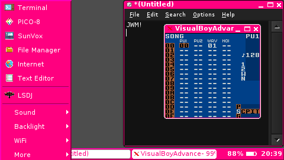

# pocketchip-jwmrc

[JWM](https://joewing.net/projects/jwm/) is a very nice window manager that can be used as a lighter replacement 
for the standard window manager on Pocket CHIP (pocket-home). 

Pocket-home is not bad, especially in the beginning, but it is a bit slow to start and it eats CPU even when not being 
in foreground (around 3%, but this is enough to cause some emulators to stutter). It's also a bit hard to customize.

In this repo you can find a config I use with JWM along with a little program displaying battery level in the tray. 

## Features 

- Access to the standard Pocket CHIP apps.
- Shutdown and reboot options.
- Battery indicator (use my replacement for pocketchip-batt service for better linearity).
- Backlight & volume control.

You can add your programs by editing `.jwmrc` (accessible via Menu > More > Edit .jwmrc).

Missing:

- No easy WiFi config.

## Keys

- Main menu: `Ctrl+Escape` or press anywhere on the desktop.
- Switch between windows: `Ctrl+Tab` or `Alt+Tab`.
- Close a window: `Ctrl+W` or `Ctrl+Q`.
- Menu for the current window: `Shift+Escape`.
- Make a screenshot: `Shift+Alt+3`.
- Switch to desktop 1 (2, 3 or 4): `Ctrl+1` (`Ctrl+2`, `Ctrl+3`, `Ctrl+4`).

## Installation

1. Install JWM:

	sudo apt-get install jwm

2. Install this config along a little X program that is used to display battery level:

	sudo make install	

3. Reboot.

Enjoy!

